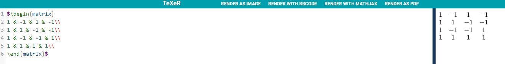
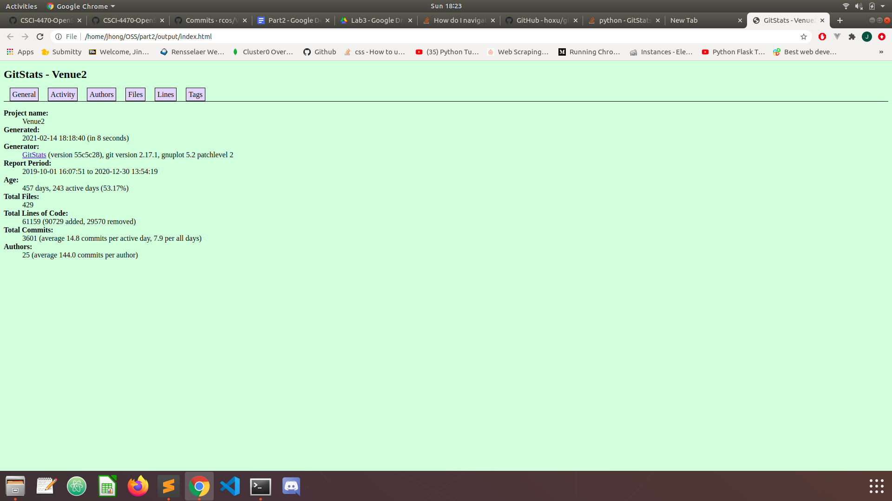

# Lab 02 Report - Documentation and Community

# 1
I would like to work on a project related to analyzing and visualizing real time statistics from the NBA. One open source product that I may look into using is Jupyter Notebook.  
Jupyter Notebook allows its users to create items called notebooks. Notebooks are human readable web pages that contain computer code and rich text elements such as equations, figures and graphs.   
I am planning on using Jupyter Notebook in conjunction with an api called nba-api to create web pages that have different figures based on player data.   
Nba-api directly pulls player statistics from nba.com. Another tool I may use is Flask. Flask is a lightweight web framework that uses python as its main language.   
I have used Flask before I believe it would allow me to quickly spin up the first version of the webpage I want to create.  
  
The goal of my project is to allow users to easily compare nba players. With the use of interesting charts and graphics users may be able to compare statistics more efficiently.   
I would also like to implement my own equation that uses data from the api and actively ranks NBA players.   
All of this would be possible with a web application that focuses on clean and simple aesthetics that clearly showcases different aspects of the website.  

  
  
  

# 2
Project - Venue  
Number of Contributors - 16
Lines of Code - 562,692  
First Commit -    
- Name: tdurkin18  
- Date: October 1, 2019  
- Message: “Initial commit”  
Last Commit - 
- Name: TheStopsign  
- Date: December 30, 2020  
- Message: “redact numfor’s password”  

  
The lines of code and the number of contributors are different. Gitstats states that there are 61159 lines while Github states that there are 562,692 lines.   
Gitstats also states that there are 25 contributors while Github states that there are 16 contributors.  

  

