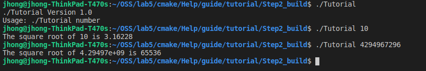
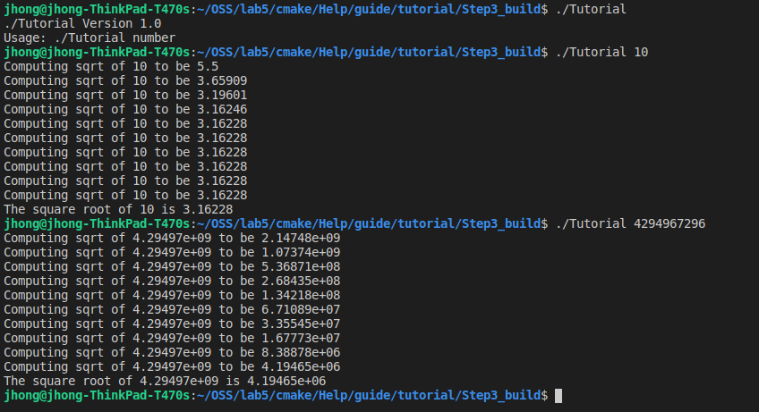
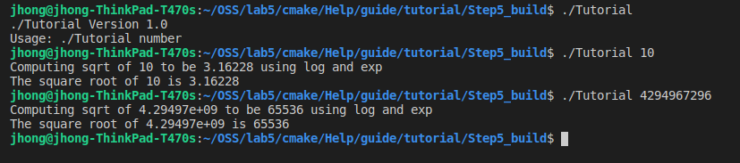

# Lab 05 Report - Build Systems

## Part 1  

### Step 1  
  
https://github.com/johnhong36/oss-repo-template/blob/master/labs/lab-05/step1/tutorial.cxx  
https://github.com/johnhong36/oss-repo-template/blob/master/labs/lab-05/step1/CMakeLists.txt    

### Step 2  
  
https://github.com/johnhong36/oss-repo-template/blob/master/labs/lab-05/step2/tutorial.cxx  
https://github.com/johnhong36/oss-repo-template/blob/master/labs/lab-05/step2/CMakeLists.txt    

### Step 3  
  
https://github.com/johnhong36/oss-repo-template/blob/master/labs/lab-05/step3/CMakeLists.txt  
https://github.com/johnhong36/oss-repo-template/blob/master/labs/lab-05/step3/CMakeLists.txt(Math%20Func)  

### Step 4  
  
https://github.com/johnhong36/oss-repo-template/blob/master/labs/lab-05/step4/CMakeLists.txt  
https://github.com/johnhong36/oss-repo-template/blob/master/labs/lab-05/step4/CMakeLists.txt(Math%20Func)  

### Step 5  
  
https://github.com/johnhong36/oss-repo-template/blob/master/labs/lab-05/step5/CMakeLists.txt  
https://github.com/johnhong36/oss-repo-template/blob/master/labs/lab-05/step5/CMakeLists.txt(Math%20Func)  

## Part 2  

