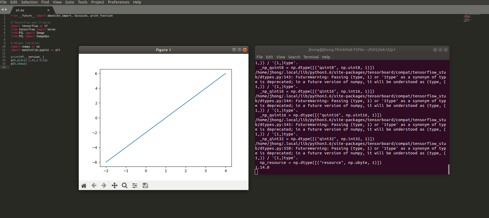
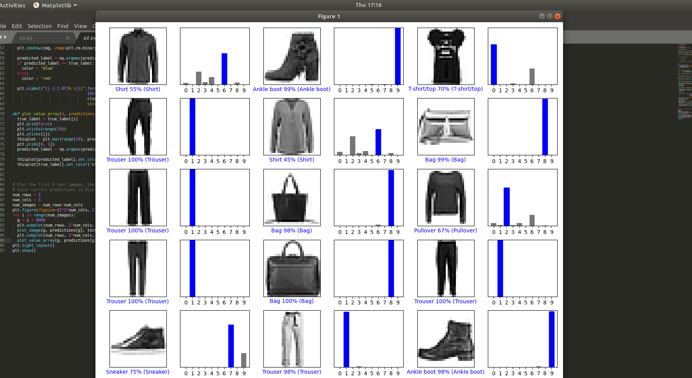
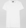
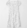

# Lab 11 Report - TensorFlow     

## Part 1   
  
## Part 2   
  

## Part 3  
  
  

[[5.7159583e-10 4.8689514e-14 7.4653720e-18 9.0795847e-14 6.1884566e-14  
  4.1410098e-09 1.9081763e-09 1.5441089e-10 1.0000000e+00 3.5969773e-08]]  

  
  

[[3.3248580e-31 0.0000000e+00 0.0000000e+00 0.0000000e+00 0.0000000e+00  
  4.6080923e-13 5.5145714e-22 1.6747232e-30 1.0000000e+00 1.2369036e-17]]  

  
  

[[1.9407337e-11 2.8170529e-15 5.0687083e-15 9.4208330e-10 2.3548656e-09  
  2.2117133e-14 4.4533026e-05 5.1820901e-13 9.9995518e-01 2.4609918e-07]]  
